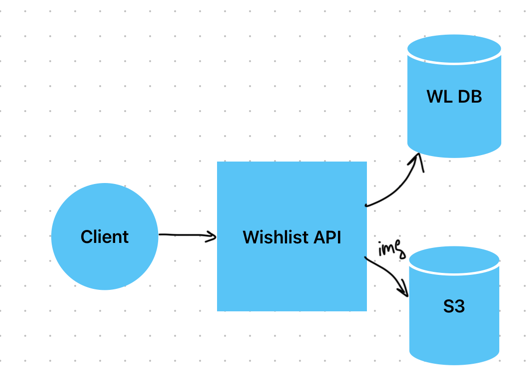

# Wishlist REST API

REST API for my wishlist app

## Features

1. Person can create one personal wishlist.
2. Person can add, modify and delete items in the wishlist.
3. Another persons can view this person's wishlist and reserve items as gifts.
4. The reserver can unreserve it at any time.
5. There can be only one reserver for the same item.
6. The reserver can reveal their name, keep it hidden or leave a hint.
7. The wishlist owner cannot delete reserved items.
8. The wishlist owner can unreserve an item, but only according to the following logic:
   - Owner makes a request to unreserve the item
   - The reserver receives notification to confirm reservation cancellation. 
   - The reserver has 3 days to confirm the cancellation or reject it for any reason.
   - If the reserver agreed to cancel the reservation or didn't respond, the reservation is canceled.
   - If the reserver disagreed to cancel the reservation, the reservation is kept.

## Item details
Each item have these properties (* means "required"):
   - title *
   - description
   - from 0 to 10 photos
   - link to the shop

Each item can have one of the statuses:
   - unreserved (initial status)
   - reserved (when the reserver reserves the item)
   - gifted (when the wishlist owner confirmed the giving)

## App structure

## DB Schema

### Table Wishlist
- guid (unique)
- owner_id (unique)
- created_at
- updated_at
### Table WishlistItem
- guid (unique)
- wishlist_id
- status (enum: unreserved, reserved, gifted)
- is_visible
- title (required)
- description
- link
- created_at
- updated_at
- deleted_at
### Table Reservation
- guid (unique)
- wishlist_id 
- reserver_id
- item_id
- confirm_till
- cancelled_at
- created_at
- updated_at
- deleted_at
### Table ItemImages
- guid (unique)
- item_id
- filename
- mimetype